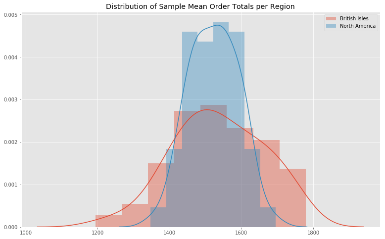

# Mod 3 Project
<a id="Introduction"></a>
## Introduction
The goal of this project is to explore and query the Northwind database, formulate at least four separate hypotheses, and perform statistical analysis to draw a conclusion about each hypothesis.

### Database Schema:


## Questions
The four questions I'm basing my hypotheses on are:<br>
- [**Question 1**](#question_1): Does discount amount have a statistically significant effect on the quantity of a product in an order? If so, at what level(s) of discount?<br>
- [**Question 2**](#question_2): Do employees have a statistically significant effect on order values? If so, does the employee's region have a statistically significant effect?<br>
- [**Question 3**](#question_3): Does the customer's region have a statistically significant impact on the amount of orders they submit?<br>
- [**Question 4**](#question_4): Did items that are now discontinued have a statistically significant difference on order values?<br>

## Methodology
With each question, I formulated at least one Null Hypothesis and at least one Alternate Hypothesis. From there I gathered the data using a combination of SQL and Pandas to group it appropriately and make it more easily readable and pliable. I then created a few visualizations to allow an eyeballing of the data, and determined the normality of the distributions.<br>

From there, if necessary, I pulled sample distributions to improve the normality, double-checked it, then checked the variances to determine which T-Test would best fit that dataset. I then ran the necessary tests including Student's T-Test, Welch's T-Test, ANOVA, and TUKEY to determine whether or not the Null Hypothesis was rejected. Finally, I formed my conclusion and recommendations based on the results of those tests, including any secondary run-throughs of the data if more than one hypothesis was formulated to answer the initial question.

## Question Breakdown

<a id="question_1"></a>
### Question 1: Does discount amount have a statistically significant effect on the quantity of a product in an order? If so, at what level(s) of discount?
[Notebook](question_1.ipynb)
<details open><summary><b>Hypothesis:</b></summary>
<b>H0</b>: non_discounted_mean_quantity = discounted_mean_quantity<br>
<b>HA</b>: non_discounted_mean_quantity != discounted_mean_quantity<br>
</details>

<details><summary><b>Gathering Data:</b></summary>
    
```
query = """SELECT Discount, ROUND(avg(Quantity),2) AS AvgQuantity,
                  MIN(Quantity) AS MinQuantity, MAX(Quantity) AS MaxQuantity,
                  COUNT(*) AS TotalOrders
           FROM OrderDetail
           GROUP BY Discount
           """
```

</details>

<details open><summary><b>Visualizations:</b></summary>
Initial Data:
    

    
Sample Data:


</details>

<details><summary><b>Testing:</b></summary>
<b>Tukey Test</b>:
    
    ```
    tk = smc.MultiComparison(df['Quantity'], df['Discount'])
    result = tk.tukeyhsd()
    ```

    
<b>Effect Size</b>:
```
for level in discount_levels:
    full_price = samp_dict[0.00]
    if level != 0.00:
        d = cohens_d(full_price, samp_dict[level])
        print(f'Effect Size (d) for Discount Level {level*100}%: {np.abs(d)}')
```
Effect Size (d) for Discount Level 5.0%: 1.449901660625435 <br>
Effect Size (d) for Discount Level 10.0%: 0.7906985124409258 <br>
Effect Size (d) for Discount Level 15.0%: 1.5557912351179988<br>
Effect Size (d) for Discount Level 20.0%: 1.3523624132972651<br>
Effect Size (d) for Discount Level 25.0%: 1.5240289749174045<br>
</details>

<details open><summary><b>Conclusion:</b></summary>
Based on the Effect Sizes above, the largest difference in quantity ordered is a discount of 15%, followed closely by 25%. Were I providing recommendations to a company, I would suggest that 5% and 15% would give them the biggest bang for their buck (or rather the largest effect for least reduction in price) and I would recommend avoiding the 10% discount altogether as it does not provide a statistically significant difference in quantity ordered.
</details>

<a id="question_2"></a>
### Question 2: Do employees have a statistically significant effect on order values? If so, does the employee's region have a statistically significant effect?
[Notebook](question_2.ipynb)
<details open><summary><b>Hypothesis 1:</b></summary>
<b>H0</b>: mean_order_value_i = mean_order_value_j for each pair of employees<br>
<b>HA</b>: mean_order_value_i != mean_order_value_j for each pair of employees<br>
    
</details>

<details open><summary><b>Hypothesis 2:</b></summary>
<b>H0</b>: mean_order_value_british_isles = mean_order_value_north_america<br>
<b>HA</b>: mean_order_value_british_isles != mean_order_value_north_america<br>
    
</details>

<details><summary><b>Gathering Data:</b></summary>
    
```
    query = """SELECT EmployeeID, Region, ROUND(AVG(ItemTotal), 2) as AvgTotal,
           MIN(ItemTotal) as MinTotal, MAX(ItemTotal) as MaxTotal, 
           COUNT(*) as TotalOrders
           FROM (SELECT e.Id as EmployeeID, e.Region, od.OrderID, 
                   SUM(od.UnitPrice * od.Quantity * (1 - od.Discount)) as ItemTotal
                   FROM Employee e
                   JOIN 'Order' o
                   ON o.EmployeeID = e.Id
                   JOIN OrderDetail od
                   ON o.Id = od.OrderID
                   GROUP BY 3)
           GROUP BY 1
           """
```


```
query = """SELECT EmployeeID, Region, ROUND(AVG(OrderTotal), 2) as AvgTotal,
           MIN(OrderTotal) as MinTotal, MAX(OrderTotal) as MaxTotal, 
           COUNT(*) as TotalOrders
           FROM (SELECT e.Id as EmployeeID, e.Region, od.OrderID, 
                 SUM(od.UnitPrice * od.Quantity * (1 - od.Discount)) as OrderTotal
                 FROM Employee e
                 JOIN 'Order' o
                 ON o.EmployeeID = e.Id
                 JOIN OrderDetail od
                 ON o.Id = od.OrderID
                 GROUP BY 3)
           GROUP BY 2
           """
```


</details>

<details open><summary><b>Visualizations:</b></summary>
Region Data:
    


Region Sample Means:


    
Employee Data:


Employee Sample Means:


</details>

<details><summary><b>Testing:</b></summary>
<b>Tukey Test</b>:    
   
```
tk = smc.MultiComparison(samp_df['SampleOrderTotalMean'], samp_df['EmployeeID'])
result = tk.tukeyhsd()
```


<b>Effect Size</b>:
```
for id in sorted(samp_df.EmployeeID.unique()):
    if id != 6:
        d = cohens_d(samp_dict[id], samp_dict[6])
        print(f'Effect Size (d) for EmployeeID 6 vs EmployeeID {id}: {d}')
```
Effect Size (d) for EmployeeID 6 vs EmployeeID 1: 3.2275151433845415<br>
Effect Size (d) for EmployeeID 6 vs EmployeeID 2: 3.878939240303298<br>
Effect Size (d) for EmployeeID 6 vs EmployeeID 3: 3.2409139330584913<br>
Effect Size (d) for EmployeeID 6 vs EmployeeID 4: 3.0134296294049894<br>
Effect Size (d) for EmployeeID 6 vs EmployeeID 5: 2.6168286381625485<br>
Effect Size (d) for EmployeeID 6 vs EmployeeID 7: 3.040556390925239<br>
Effect Size (d) for EmployeeID 6 vs EmployeeID 8: 0.9255674545285751<br>
Effect Size (d) for EmployeeID 6 vs EmployeeID 9: 2.3518656690053765<br>

</details>

<details open><summary><b>Conclusion:</b></summary>
Looking at both the original dataset and the sample dataset, it's evident that the employees with the IDs of 6 and 8 have significantly lower numbers than the rest, though the rest of the employees are, for the most part, pretty close to each other in terms of order values.

My recommendation, based on the original dataset, would be to have the employees with the IDs of 6 and 8 train with the employees with the IDs of 5 and 9, as they would seemingly provide the best knowledge based on their order values.

Oddly enough, it does appear that both the worst and the best reps are from the British Isles office, implying that the North American office, while not outstanding, is very consistent in their sales techniques. They may also be able to learn a thing or two from the top reps from the British Isles.

</details>

<a id="question_3"></a>
### Question 3: Does the customer's region have a statistically significant impact on the amount of orders they submit?
[Notebook](question_3.ipynb)
<details open><summary><b>Hypothesis:</b></summary>
<b>H0</b>: mean_order_number_europe = mean_order_number_americas<br>
<b>HA</b>: mean_order_number_europe != mean_order_number_americas<br>
    
</details>

<details><summary><b>Gathering Data:</b></summary>

```
query = """SELECT COUNT(DISTINCT c.Id) as NumCustomers, COUNT(DISTINCT o.ID) as NumOrders, 
           c.Region as CustomerRegion, (COUNT(DISTINCT o.Id) / COUNT(DISTINCT c.ID)) as AvgOrderPerCustomer
           FROM Customer c
           JOIN 'Order' o
           ON c.Id = o.CustomerID
           GROUP BY 3
           """
```


</details>

<details open><summary><b>Visualizations:</b></summary>
Original Data:


Sample Means:


</details>

<details><summary><b>Testing:</b></summary>
<b>TTest</b>:

```
stats.ttest_ind(samp_dict['Americas'], samp_dict['Europe'])
```
Ttest_indResult(statistic=-6.79272087090113, pvalue=1.2571276030446462e-10)

<b>Effect Size</b>:
```
d = fs.cohens_d(samp_dict['Europe'], samp_dict['Americas'])
```
Effect Size (d) for Customer Region Sample Set: 0.9654753037865513

<b>Power</b>:
```
tt_ind_solve_power(effect_size=d, nobs1=sample_size, alpha=a)
```
0.8449808569501598

</details>

<details open><summary><b>Conclusion:</b></summary>
After fully testing the sample mean distributions, it does appear that there is a statistically significant difference in number of orders based on customer's region, and with a power of 84.5% we're fairly confident that we are correctly rejecting our Null Hypothesis.

Based on the results and an effect size of .97, I would recommend focusing our sales to customers in the European region, as there is a higher chance of generating a sale, and potentially having a repeat customer as well as the average number of orders per customer is higher for Europe, specifically in Northern and Western Europe.

</details>

<a id="question_4"></a>
### Question 4: Did items that are now discontinued have a statistically significant difference on order values?
[Notebook](question_4.ipynb)
<details open><summary><b>Hypothesis:</b></summary>
<b>H0</b>: discontinued_mean_order_value = not_discontinued_mean_order_value<br>
<b>HA</b>: discontinued_mean_order_value != not_discontinued_mean_order_value<br>
    
</details>

<details><summary><b>Gathering Data:</b></summary>

```
query = """SELECT COUNT(DISTINCT OrderID), ROUND(AVG(OrderTotal), 2), MAX(OrderTotal), 
           MIN(OrderTotal), Discontinued
           FROM (SELECT o.Id as OrderID, p.Discontinued,
                    SUM(o.UnitPrice * o.Quantity * (1 - o.Discount)) as OrderTotal
                    FROM OrderDetail o
                    JOIN Product p
                    ON o.ProductID = p.ID
                    GROUP BY 1)
           GROUP BY 5
           """
```


</details>

<details open><summary><b>Visualizations:</b></summary>
Original Data:
    
    

Sample Means:


</details>

<details><summary><b>Testing:</b></summary>
<b>Student's T-Test</b>:

```
stats.ttest_ind(samp_dict['Discontinued'], samp_dict['Non-Discontinued'])
```
Ttest_indResult(statistic=28.52035572037066, pvalue=4.806936143583449e-72)

<b>Effect Size</b>:
```
d = fs.cohens_d(samp_dict['Discontinued'], samp_dict['Non-Discontinued'])
```
Effect Size (d) for Discontinued Item Sample Set: 4.053706846866571

<b>Power</b>:
```
tt_ind_solve_power(effect_size=d, nobs1=sample_size, alpha=a)
```
1.0

</details>

<details open><summary><b>Conclusion:</b></summary>
After fully testing the sample mean distributions, it does appear that there is a statistically significant difference in order value if that order contains a discontinued item, and with a power of 100% we're extremely confident that we are correctly rejecting our Null Hypothesis.

Based on the results and an effect size of 4.05, I would recommend an investigation into our discontinued items and see if it's possible to bring any of them back, as they have a very large impact on the amount of revenue generated per order.

</details>

## Conclusion & Future Work
While plenty of data was gathered that could result in increased revenue for the company, there is still a vast amount of unexplored data in this database. In the future, I would like to dig deeper into the various shipping options, to determine if one of the shipping companies provides cheaper service than the others, and how much each one may affect the likelihood of a customer returning for more orders.

I would also like to discover more data, possibly filling out the customer demographic tables, to be able to explore that as a stronger indicator than just region on how likely a specific customer is to repeat order.

[Back to Introduction](#Introduction)
